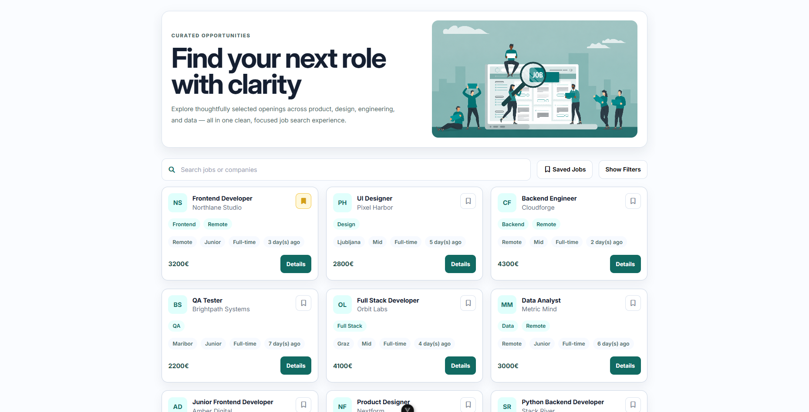
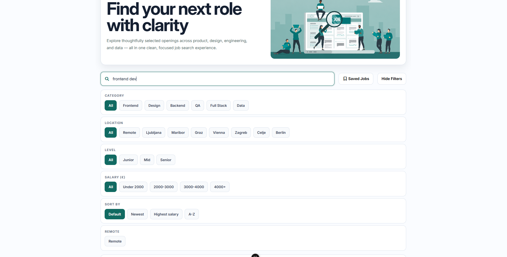
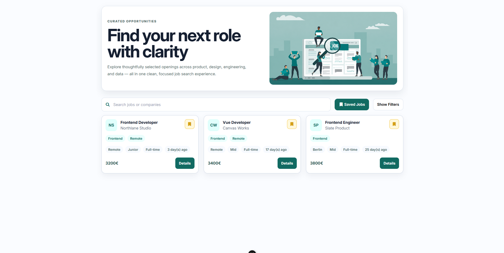
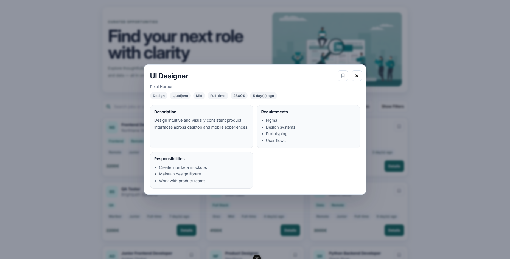
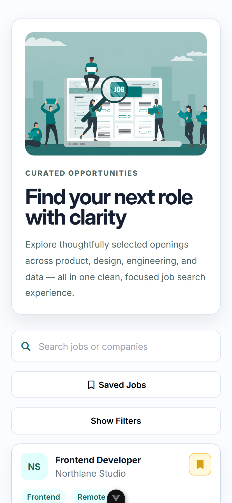
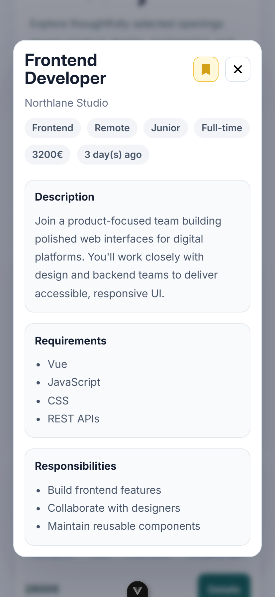

# NextJob

NextJob is a frontend job board built with Vue.

I made this project to practice working with fetched data, component communication, filtering, sorting, saved jobs, and responsive UI design in a way that feels close to a real product.

## What it does

Users can:

- search jobs by title or company
- filter by category, location, level, salary, and remote-only roles
- sort results
- save jobs
- view saved jobs only
- open a modal with more details about each role

Saved jobs are kept in `localStorage`, so they stay there after refresh.

## Built with

- Vue 3
- Composition API
- JavaScript
- CSS
- local JSON data fetched from `public/data/jobs.json`

## What I focused on

This project was mainly about improving my frontend fundamentals, especially:

- fetching and displaying data
- working with parent-owned state
- props and emits
- computed filtering and sorting
- localStorage
- responsive layout
- building reusable components

## Screenshots

### Main page



### Filters



### Saved jobs



### Job modal



### Mobile





## Run locallyPreview README

```bash
npm install
npm run dev
```
